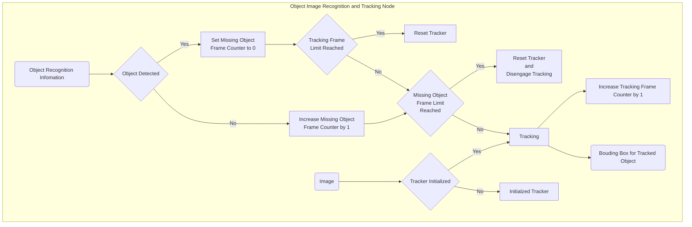

```mermaid

graph TD

    subgraph Object Image Recognition and Tracking Node

        input1(Object Recognition Infomation) --> if1{Object Detected}
        if1 -->|Yes| process1[Set Missing Object <br/> Frame Counter to 0]
        if1 -->|No| process2[Increase Missing Object <br/> Frame Counter by 1]
        
        process1 --> if2{Tracking Frame <br/> Limit Reached}
        if2 -->|Yes| process3[Reset Tracker]
        if2 -->|No| if3
        
        process2 --> if3{Missing Object <br/> Frame Limit <br/> Reached}
        if3 -->|Yes| process4[Reset Tracker <br/> and <br/> Disengage Tracking]
        if3 -->|No| process5[Tracking]

        input2(Image) --> if4{Tracker Initialized}
        if4 -->|Yes| process5
        if4 -->|No| process6[Initialzed Tracker]

        process5 --> process7[Increase Tracking Frame Counter by 1]
        process5 --> output(Bouding Box for Tracked Object)

    end

```